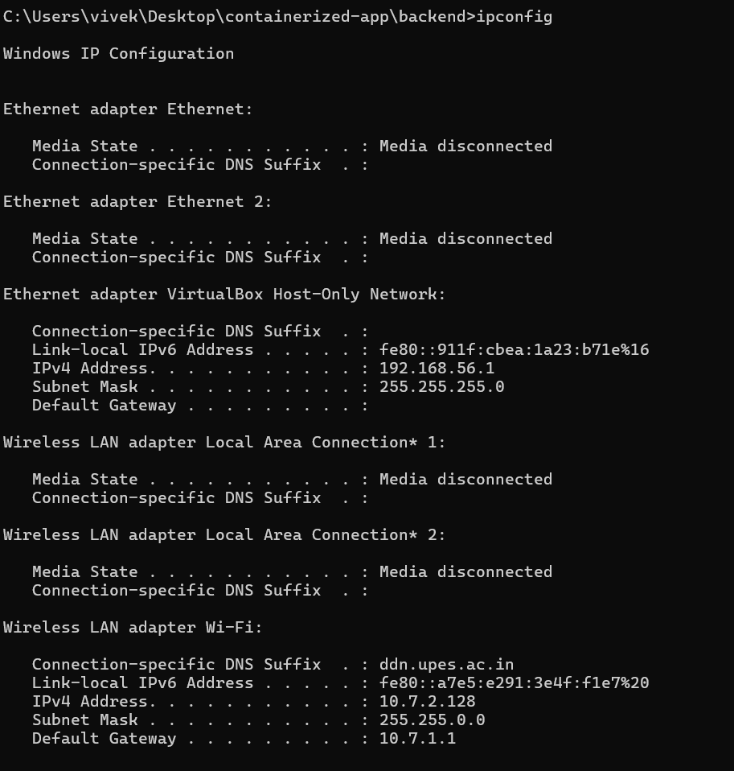
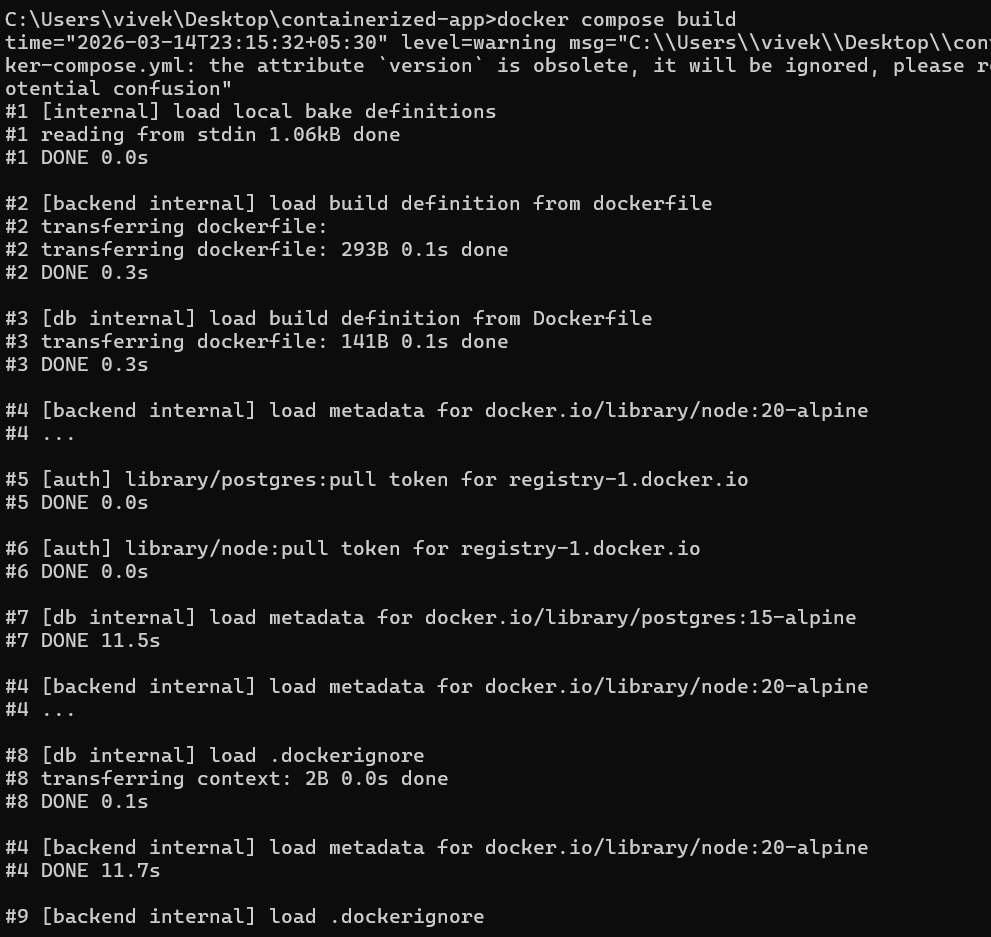
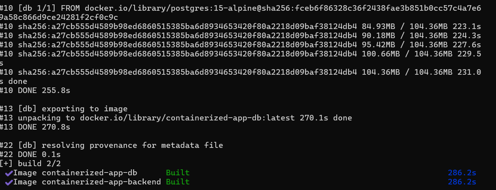
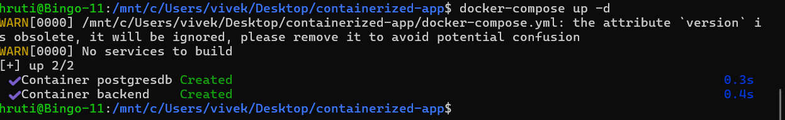
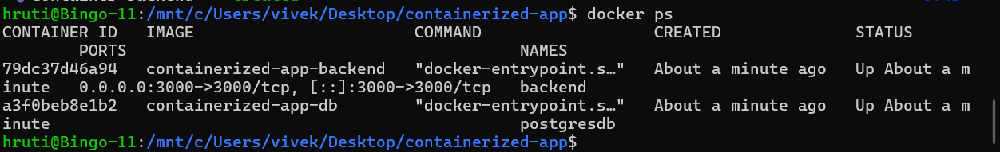
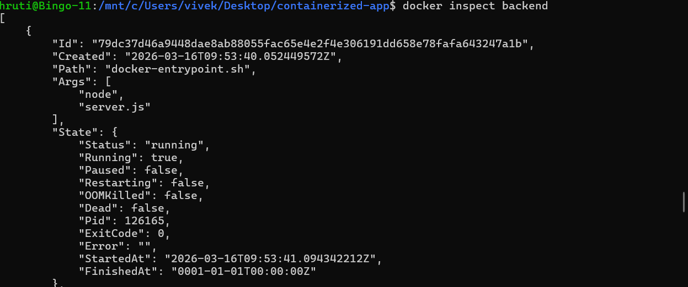
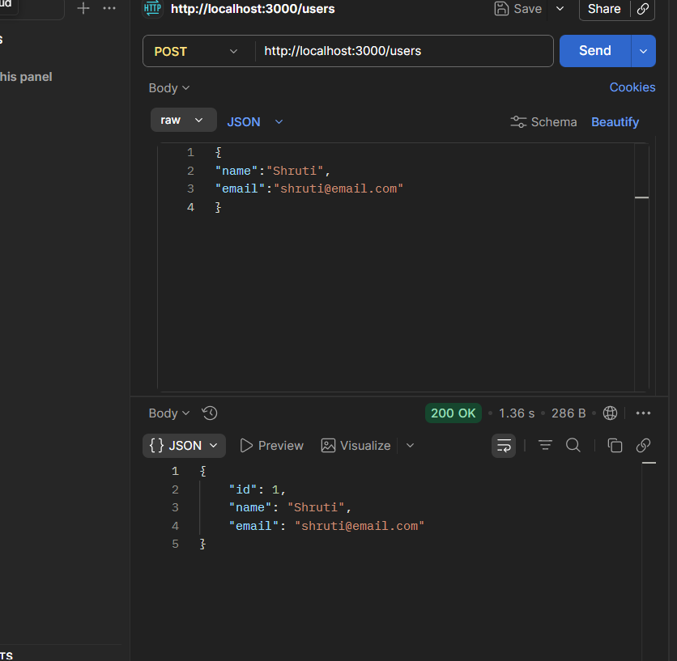
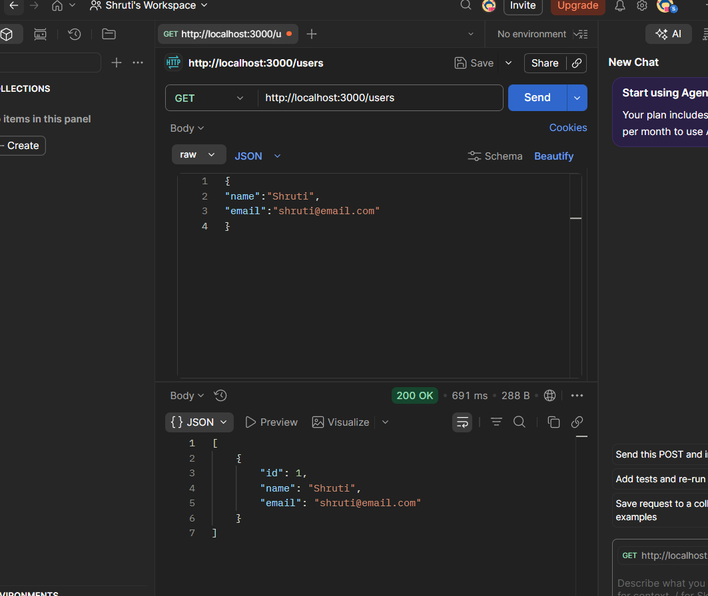

# **Containerized Application using Docker**

## **Objective**

To build and deploy a containerized application using Docker and Docker Compose.
The backend service communicates with a PostgreSQL database and the APIs are tested using Postman.

---

# **Part A: Environment Setup**

## **Step 1: Install Docker**

Download and install Docker Desktop from the official website.

🔗 https://www.docker.com/products/docker-desktop/

---

## **Step 2: Verify Docker Installation**

Check whether Docker is installed correctly.

```bash
docker --version
```

Example Output

```
Docker version 24.x.x
```


---

## **Step 3: Verify Docker Compose**

```bash
docker compose version
```

Example Output

```
Docker Compose version v2.x.x
```


---

# **Part B: Project Setup**

## **Project Directory Structure**

```
Containerized-App/
│
├── backend/
│   ├── server.js
│   ├── Dockerfile
│   └── package.json
│
├── db/
│   ├── Dockerfile
│   └── init.sql
│
├── Images/
│
├── docker-compose.yml
└── README.md
```

---

# **Part C: Network Configuration**

Before creating Docker networks, check the system network configuration.

## **Check System IP Address**

```bash
ipconfig
```

Example Output

```
IPv4 Address : 192.168.200.5
Subnet Mask  : 255.255.255.0
Gateway      : 192.168.200.1
```

This ensures that the Docker network subnet is valid.

---

# **Part D: Docker Networking Setup**

## **Create macvlan Network**

```bash
docker network create -d macvlan \
--subnet=192.168.200.0/24 \
--gateway=192.168.200.1 \
-o parent=eth0 \
macvlan_net
```

---

## **Verify Network**

```bash
docker network ls
```

Expected Output

```
macvlan_net
bridge
host
none
```

![Docker Network]

---

# **Part E: Build and Run Containers**

## **Build Docker Images**

```bash
docker compose build
```

Example Output

```
Building backend
Building db
Successfully built images
```




---

## **Start Containers**

```bash
docker compose up -d
```



---

## **Verify Running Containers**

```bash
docker ps
```

Example Output

```
CONTAINER ID   IMAGE                        PORTS
backend        containerized-app-backend    0.0.0.0:3000->3000/tcp
postgresdb     containerized-app-db
```



---

# **Part F: Container Verification**

## **Check Backend Logs**

```bash
docker logs backend
```

```
Server running on port 3000
```

---

## **Inspect Container Network**

```bash
docker inspect backend
```

Example Output

```
IPAddress: 192.168.200.10
```


---

# **Part G: API Testing using Postman**

Install Postman:

🔗 https://www.postman.com/downloads/

Postman is used to test the REST API endpoints.

---

## **Create User (POST Request)**

Method

```
POST
```

URL

```
http://localhost:3000/users
```

Body → Raw → JSON

```json
{
  "name": "Shruti",
  "email": "shruti@email.com"
}
```

Click **Send**.

---

## **Expected Response**

Status

```
200 OK
```

Response Body

```json
{
  "id": 1,
  "name": "Shruti",
  "email": "shruti@email.com"
}
```

This confirms that the data was successfully stored in the database.

---



## **Get All Users (GET Request)**

Request

```
GET http://localhost:3000/users
```

Response

```json
[
  {
    "id": 1,
    "name": "Shruti",
    "email": "shruti@email.com"
  }
]
```

---

# **Part H: Testing using Curl**

You can also test the API using curl.

```bash
curl http://localhost:3000/users
```




---

# **Part I: Access Container Terminal**

Open backend container terminal.

```bash
docker exec -it backend sh
```

Test inside container:

```bash
curl localhost:3000
```

Exit container

```bash
exit
```

---

# **Useful Docker Commands**

List running containers

```bash
docker ps
```

View logs

```bash
docker logs backend
```

Restart containers

```bash
docker compose restart
```

Stop containers

```bash
docker compose down
```

Inspect Docker network

```bash
docker network inspect macvlan_net
```

---

# **Result**

The backend application and PostgreSQL database were successfully containerized using Docker. Docker Compose was used to manage multiple containers, and macvlan networking was configured for container communication. The REST APIs were successfully tested using Postman and curl.
