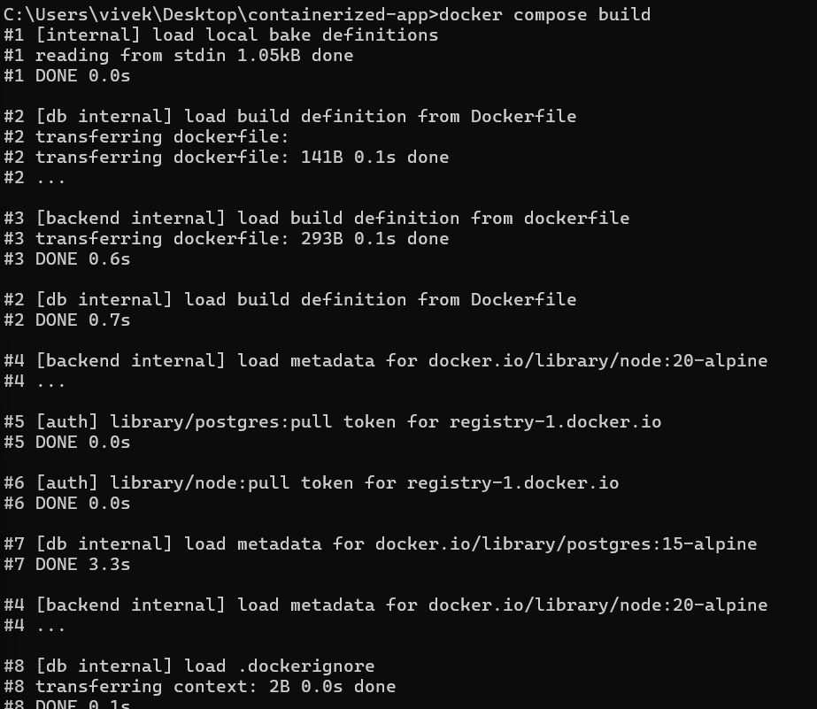
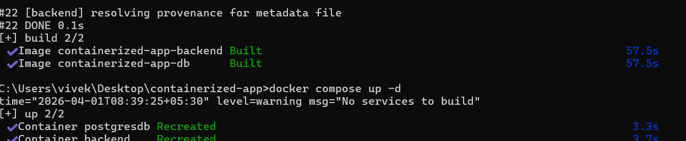
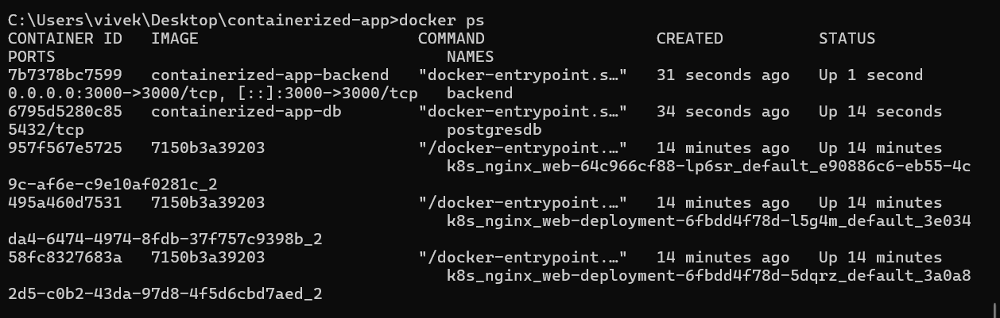
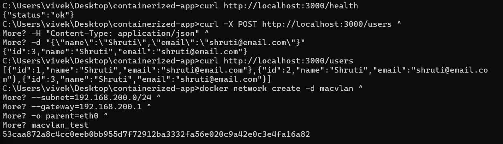
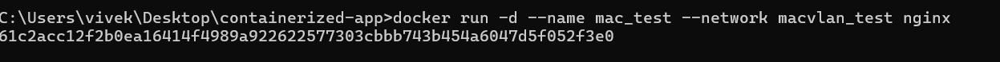
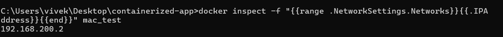
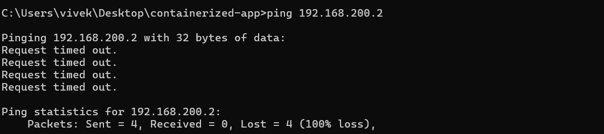
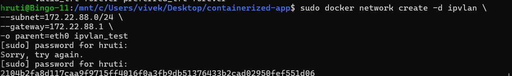
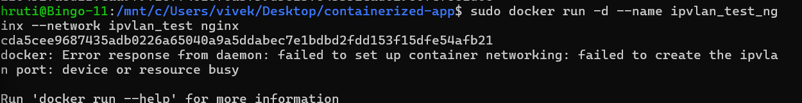

#  Containerized Node.js + PostgreSQL Application using Docker

## **Objective**

This project demonstrates building and deploying a containerized Node.js backend with a PostgreSQL database using Docker and Docker Compose. It includes testing APIs with **Postman** and **curl**, and demonstrates three types of Docker networking:

* Bridge
* Macvlan
* IPvlan

---

#  **Part A: Environment Setup**

## **Step 1: Install Docker**

Download and install Docker Desktop:

🔗 [https://www.docker.com/products/docker-desktop/](https://www.docker.com/products/docker-desktop/)

---

## **Step 2: Verify Docker Installation**

```bash
docker --version
```

Example Output:

```
Docker version 24.x.x
```

---

## **Step 3: Verify Docker Compose**

```bash
docker compose version
```

---

#  **Part B: Project Structure**

```
containerized-app/
│
├── backend/             # Node.js backend app
│   ├── server.js
│   ├── Dockerfile
│   └── package.json
│
├── db/                  # PostgreSQL setup
│   ├── Dockerfile
│   └── init.sql
│
├── Images/              # Screenshots for documentation
│
├── docker-compose.yml   # Bridge network config
└── README.md
```

---

# **Part C: System Network Configuration**

Check your system network before creating custom networks:

```bash
ipconfig   # Windows
```

Example:

```
IPv4 Address : 192.168.200.5
Subnet Mask  : 255.255.255.0
Gateway      : 192.168.200.1
```


---

#  **Part D: Docker Networking Setup**

## **1. Bridge Network (Default)**

Docker’s default **bridge network** allows communication between containers and host.

### Steps

### Build and start containers

```bash
docker compose build
docker compose up -d
```




### Verify containers

```bash
docker ps
```



### Test APIs

```bash
# Health check
curl http://localhost:3000/health

# Create user
curl -X POST http://localhost:3000/users \
-H "Content-Type: application/json" \
-d "{\"name\":\"Shruti\",\"email\":\"shruti@email.com\"}"

# Get users
curl http://localhost:3000/users
```



### Notes

* Works on Windows, Linux, WSL
* Host ↔ Container 
* Container ↔ Container 

---

## **2. Macvlan Network**

Macvlan gives containers **separate IPs on your LAN**.

### Steps

### Create network

```bash
docker network create -d macvlan \
--subnet=192.168.200.0/24 \
--gateway=192.168.200.1 \
-o parent=eth0 \
macvlan_test
```


### Run container

```bash
docker run -d --name mac_test --network macvlan_test nginx
```


### Get container IP

```bash
docker inspect -f "{{range .NetworkSettings.Networks}}{{.IPAddress}}{{end}}" mac_test
```


### Test connectivity

```bash
ping <container_ip>
curl http://<container_ip>
```



### Limitations

* No direct host ↔ container communication
* Works only if host supports macvlan
* Used for LAN-level isolation

---

## **3. IPvlan Network (Linux / WSL Only)**

Similar to macvlan but more scalable and flexible.

### Steps

### Create network

```bash
sudo docker network create -d ipvlan \
--subnet=172.22.88.0/24 \
--gateway=172.22.88.1 \
-o parent=eth0 ipvlan_test
```




### Run container

```bash
sudo docker run -d --name ipvlan_test_nginx --network ipvlan_test nginx
```


### Get container IP

```bash
docker inspect -f "{{range .NetworkSettings.Networks}}{{.IPAddress}}{{end}}" ipvlan_test_nginx
```

### Notes

* Works only on Linux / WSL
* Host communication may need routing
* Best for large-scale networking

---

#  **Part E: API Testing using Curl**

```bash
# Get users
curl http://localhost:3000/users

# Create user
curl -X POST http://localhost:3000/users \
-H "Content-Type: application/json" \
-d "{\"name\":\"Shruti\",\"email\":\"shruti@email.com\"}"
```

---

#  **Part F: Access Container Terminal**

```bash
docker exec -it backend sh
```

### Test inside container

```bash
curl localhost:3000
```

### Exit

```bash
exit
```

---

#  **Part G: Cleanup**

```bash
docker compose down --volumes
docker rm -f mac_test ipvlan_test_nginx
docker network rm macvlan_test ipvlan_test
```

---

#  **Part H: Key Comparison**

| Network Type | Host ↔ Container | Container ↔ Container |   Notes          |
| ------------ | ---------------- | --------------------- | ---------------- |
| Bridge       |   Works          |    Works              | Default, easiest |
| Macvlan      |   No direct      |    Works              | Separate LAN IP  |
| IPvlan       |   Limited        |    Works              | Linux only       |

---

#  **Part I: Useful Docker Commands**

```bash
docker ps
docker logs <container>
docker compose restart
docker compose down
docker network inspect <network>
```