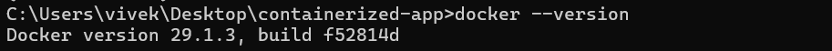

#### **Containerized Node.js + PostgreSQL Application using Docker**

## **Objective**

This project demonstrates building and deploying a containerized Node.js backend with a PostgreSQL database using Docker and Docker Compose. It includes testing APIs with **Postman** and **curl**, and demonstrates three types of Docker networking: **bridge**, **macvlan**, and **ipvlan**.

---

<<<<<<< HEAD
# **Part A: Environment Setup**

## **Step 1: Install Docker**

Download and install Docker Desktop from the official website.

🔗 https://www.docker.com/products/docker-desktop/

---

## **Step 2: Verify Docker Installation**

Check whether Docker is installed correctly.

```bash
docker --version
```

Example Output

```
Docker version 24.x.x
```


---

## **Step 3: Verify Docker Compose**

```bash
docker compose version
```

Example Output

```
Docker Compose version v2.x.x
```


---

# **Part B: Project Setup**

## **Project Directory Structure**

```
Containerized-App/
=======
## **Project Structure**

```
containerized-app/
>>>>>>> f09f930 (Updated README.md)
│
├── backend/             # Node.js backend app
│   ├── server.js
│   ├── Dockerfile
│   └── package.json
│
├── db/                  # PostgreSQL Dockerfile and init scripts
│   ├── Dockerfile
│   └── init.sql
│
├── Images/              # Screenshots for documentation
│
├── docker-compose.yml   # Compose file for bridge network
└── README.md
```

---

# **Part A: Environment Setup**

### Step 1: Install Docker

Download and install Docker Desktop:

🔗 [Docker Desktop](https://www.docker.com/products/docker-desktop/)

### Step 2: Verify Docker Installation

```bash
docker --version
```


 output:


### Step 3: Verify Docker Compose

```bash
docker compose version
```

---

# **Part B: System Network Configuration**

Before creating custom networks, check your system network configuration.

```bash
ipconfig    # Windows
    
```

Example output:

```
IPv4 Address : 192.168.200.5
Subnet Mask  : 255.255.255.0
Gateway      : 192.168.200.1
```

---

# **Part C: Docker Networking Setup**

## **1. Bridge Network (Default)** 

Docker's default **bridge network** allows containers to communicate with each other and with the host.

### Steps

1. Build and start containers:

```bash
docker compose build
docker compose up -d
```


2. Verify running containers:

```bash
docker ps
```


3. Test API endpoints:

```bash
# Health check
curl http://localhost:3000/health

# Create user
curl -X POST http://localhost:3000/users -H "Content-Type: application/json" -d "{\"name\":\"Shruti\",\"email\":\"shruti@email.com\"}"

# Get all users
curl http://localhost:3000/users
```

**Notes:**

* Works on **Windows, Linux, and WSL**.
* Host ↔ container and container ↔ container communication works out of the box.

---


## **2. Macvlan Network** 

**Macvlan** allows containers to appear as separate devices on the LAN with their own IPs.

### Steps

1. Create macvlan network:

```bash
docker network create -d macvlan \
--subnet=192.168.200.0/24 \
--gateway=192.168.200.1 \
-o parent=eth0 \
macvlan_test
```

2. Run a container on macvlan:

```bash
docker run -d --name mac_test --network macvlan_test nginx
```


<<<<<<< HEAD
```
macvlan_net
bridge
host
none
```

---

# **Part E: Build and Run Containers**

## **Build Docker Images**
=======
3. Get container IP:
>>>>>>> f09f930 (Updated README.md)

```bash
docker inspect -f "{{range .NetworkSettings.Networks}}{{.IPAddress}}{{end}}" mac_test
```


4. Test connectivity:

```bash
ping <container_ip>
curl http://<container_ip>
```


**Limitations:**

* Containers **cannot communicate directly with the host**.
* Works only if host network supports macvlan.
* Used for isolated network scenarios.

---

## **3. IPvlan Network**  (Linux / WSL Only)

**IPvlan** is similar to macvlan but solves some macvlan limitations like multiple IP subinterfaces.

### Steps

1. Create IPvlan network:

```bash
sudo docker network create -d ipvlan \
--subnet=172.22.88.0/24 \
--gateway=172.22.88.1 \
-o parent=eth0 ipvlan_test
```


2. Run container on ipvlan:

```bash
sudo docker run -d --name ipvlan_test_nginx --network ipvlan_test nginx
```


3. Get container IP:

```bash
docker inspect -f "{{range .NetworkSettings.Networks}}{{.IPAddress}}{{end}}" ipvlan_test_nginx
```


**Notes:**

* Works only on **Linux or WSL**.
* Host ↔ container communication may require extra routing.
* Useful for high-density container networking.

---

---

# **Part D: Testing using Curl**

```bash
# Get users
curl http://localhost:3000/users

# Create user
curl -X POST http://localhost:3000/users -H "Content-Type: application/json" -d "{\"name\":\"Shruti\",\"email\":\"shruti@email.com\"}"
```

---

# **Part F: Access Container Terminal**

Open backend container terminal:

```bash
docker exec -it backend sh
```

Test inside container:

```bash
curl localhost:3000
```

Exit container:

```bash
exit
```

---

# **Part G: Cleanup**

Remove containers and networks:

```bash
docker compose down --volumes
docker rm -f mac_test ipvlan_test_nginx
docker network rm macvlan_test ipvlan_test
```

---

# **Part H: Key Points**

| Network Type | Host ↔ Container | Container ↔ Container | Notes                             |
| ------------ | ---------------- | --------------------- | --------------------------------- |
| Bridge       | Works            |   Works               | Default, reliable                 |
| Macvlan      | No direct        |   Works               | Separate LAN IPs                  |
| IPvlan       | Limited          |   Works               | Linux only, solves macvlan issues |

---

# **Part I: Useful Docker Commands**

```bash
docker ps                 # List running containers
docker logs <container>   # View container logs
docker compose restart    # Restart containers
docker compose down       # Stop containers
docker network inspect <network>  # Inspect network
```
